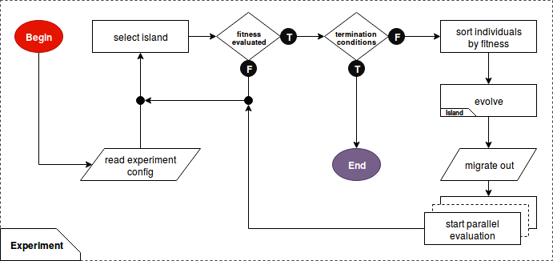
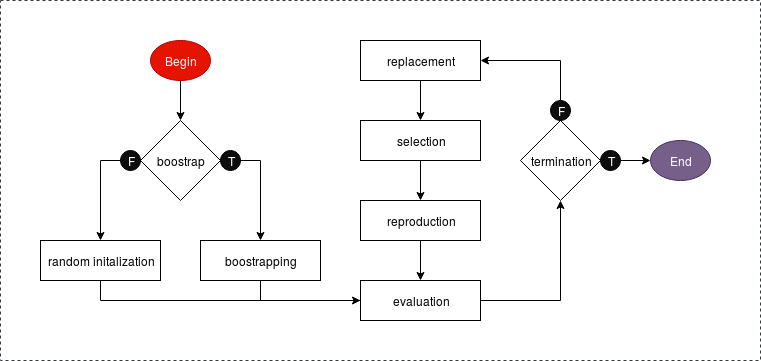

# GPEC lib
### General Purpose Evolutionary Computation library
##### `python library` | `parallel computation` | `ga/gp supported` | `island-based` | `highly customizable`
Description of the project.

## 0 Licensing
Copyright <YEAR> <COPYRIGHT HOLDER>
          
Redistribution and use in source and binary forms, with or without modification, are permitted provided that the following conditions are met:
          
  1. Redistributions of source code must retain the above copyright notice, this list of conditions and the following disclaimer.
          
  2. Redistributions in binary form must reproduce the above copyright notice, this list of conditions and the following disclaimer in the documentation and/or other materials provided with the distribution.
          
  3. Neither the name of the copyright holder nor the names of its contributors may be used to endorse or promote products derived from this software without specific prior written permission.
          
<span style="color:red; font-size:0.5em">
THIS SOFTWARE IS PROVIDED BY THE COPYRIGHT HOLDERS AND CONTRIBUTORS "AS IS" AND ANY EXPRESS OR IMPLIED WARRANTIES, 
INCLUDING, BUT NOT LIMITED TO, THE IMPLIED WARRANTIES OF MERCHANTABILITY AND FITNESS FOR A PARTICULAR PURPOSE ARE DISCLAIMED. 
IN NO EVENT SHALL THE COPYRIGHT HOLDER OR CONTRIBUTORS BE LIABLE FOR ANY DIRECT, INDIRECT, INCIDENTAL, SPECIAL, EXEMPLARY, OR CONSEQUENTIAL DAMAGES (INCLUDING, BUT NOT LIMITED TO, PROCUREMENT OF SUBSTITUTE GOODS OR SERVICES; LOSS OF USE, DATA, OR PROFITS; 
OR BUSINESS INTERRUPTION) HOWEVER CAUSED AND ON ANY THEORY OF LIABILITY, WHETHER IN CONTRACT, STRICT LIABILITY, OR TORT (INCLUDING NEGLIGENCE OR OTHERWISE) ARISING IN ANY WAY OUT OF THE USE OF THIS SOFTWARE, EVEN IF ADVISED OF THE POSSIBILITY OF SUCH DAMAGE.
</span>
 
 


## 1 Author
`Blazej Banaszewski`, MSc student of Robotics at University of Southern Denmark.

## 2 Acknowledgements
Special acknowledgements to `John Hallam` for the support, broadening the perspectives and being an inspiration.

## 3 Run
> $ python3 master.py experiment_name


## 4 Experiment configuration file  

The experiment files should be placed in:

> exp/<experiment_name>.xml

Each experiment has to consist of at least one island and one termination condition.
For each island a set of reproduction, replacement, selection and migration policies has to be defined.

The following code shows how to prepare an experiment terminated after 6 seconds, involving two identical islands,
working together on the same problem and sporadically exchanging individuals: 

```xml
<experiment chromosome_length="11" max_fitness="0" max_time="6" max_generations="0">
    <island population_size="10" evaluator="times_plus_one_max" genotype_repair="false">
        <reproduction crossover_points="6" mutation_rate="10" num_of_parents="3"/>
        <selection policy="roulette_wheel" num_of_parents="3" mutli-parent="true"/>
        <migration entry_policy="periodical" in="true" out="true" period="5"
                   selection_policy="roulette_wheel" immigrants="1" emigrants="1"/>
        <replacement policy="elitism" num_of_elites="2"/>
    </island>

    <island population_size="10" evaluator="times_plus_one_max" genotype_repair="false">
        <reproduction crossover_points="6" mutation_rate="10" num_of_parents="3"/>
        <selection policy="roulette_wheel"/>
        <migration entry_policy="probabilistic" in="true" out="true" chance="5"
                   selection_policy="roulette_wheel" immigrants="1" emigrants="1"/>
        <replacement policy="elitism" num_of_elites="2"/>
    </island>
</experiment>
```

The available variations of different techniques have been listed below.
All parameters with an exclamation mark before the name are required and if not provided,
GPEC will return an error or output an unreliable result. 
The remaining parameters will be set to corresponding defaults if a configuration value has not been provided.


#### 4.1 Experiment customization
**!** Int `chromosome_length`   
Number of genes encoding a chromosome. 
A gene can represent for a numerical value, including its sign, or a mathematical function.

###### 4.1.0 Termination conditions
Termination conditions are inclusive, which means that termination will occur when the first of them is met.
All of the conditions need a value assigned to them. Assigning a zero disables a condition.
  
**!** Int `max_fitness`  

**!** Int `max_time`   
 
**!** Int `max_generations`   

#### 4.2 Island customization  

**!** Int `population_size`   

**!** Int `evaluator` 
Name of the fitness evaluation function. 
Islands within an experiment do not have to be evaluated by the same function.
An evaluator has to be properly defined. An instruction has been provided in **Sec. 5.2 Plugging new evaluator**.

###### 4.2.1 Replacement policy
Choice `replacement_policy` = elitism  
* `elitism`  
A certain number of the fittest individuals is injected to the next generation. This strategy keeps the best results
through the generations making sure that the best discovered combinations of genes survive 
the stochastic processes of selection and reproduction.
    * Int `num_of_elites` = 2  
    Number of elites injected to next generation.

* `stead-state`  
To be implemented.

###### 4.2.2 Migration policy
Although the migration is a sub-part of the replacement, for the clarity it has been defined as a separate policy.

**!** Bool `migration_out` = false  
When set to False the island is not sending out any emigrants.

**!** Bool `migration_in` = false  
When set to False the island is not taking in any immigrants.

Choice `entry_policy` = probabilistic
* `periodical`  
    * Int `period` = 5  
    In periodical migration an island takes immigrants frequently, with a `period` separation between each migration. 
* `probabilistic`  
    * Float `chance` = 10  
    Immigrants will be accepted `chance`% of the time.   

Choice `selection_policy` = roulette_wheel   
The strategy for selecting an immigrant from a list of candidates. 
The candidates are considered to be all emigrants available on the other islands.
For the available strategies look into Section **4.2.3 Selection policy**.  

Int `emigrants` = 1  
Defines how many migrants will be available for other islands. 
  
Int `immigrants` = 1  
Defines how many migrants will be taken in each period/call.

###### 4.2.3 Selection policy
Int `parents` = 2  
Number of parents used for making offspring each generation. 

Bool `multi_parent` = true  
When mutli-parent recombination is allowed all selected parents can contribute(it's stochastic, so sometimes they would
sometimes not) their genetic material to an offspring. Conversely, a pair of parents is selected to make each single offspring.

Choice `selection_policy` = roulette_wheel
* `roulette_wheel`  
The chance of an individual being selected is proportional to its fitness.
* `rank`  
The individuals are sorted based on their fitness from best to worst and the probability of making offspring is
proportional to their rank.
* `truncation`  
The individuals are sorted based on their fitness from best to worst and M best becomes parents.
Number M depends on the value assigned to `parents`.
* `tournament`  
Each parent is selected by randomly choosing two individuals from a generation and comparing their scores.
The fitter one becomes a parent.

###### 4.2.4 Reproduction policy

Int **`crossover_points`** = 2  
Number of points for crossover  

Int **`mutation_rate`** = 10  
A chance for a gene to mutate, given in %  


## 5 Evaluation functions
#### 5.1 Available evaluators
###### 5.1.1 Genetic Algorithms
- **One max** - The score is proportional to the number of ones in a binary string of a fixed length. 

###### 5.1.2 Genetic programming
- **Times plus one max** - The score is a result of multiplying (times) and adding (plus) ones. For this problem the
set of primitives consists of:  

terminals| functions  
--- | --- 
1 | multiplication, *, arity 2
. | addition, +, arity 2 


- **Symbolic regression** - Evaluates how well a provided expression models a polynomial function. 
The polynomial against which the expression is tested can be arbitrarily changed inside of the evaluator.

terminals| functions  
--- | --- 
x | multiplication, *, arity 2
real| addition, +, arity 2
. | subtraction, -, arity 2
. | exponentiation, ^, 2
. | protected division, %, 2 


#### 5.2 Plugging new evaluator
The **eval/evaluators.xml** file contains definitions of all the evaluation functions. 

```xml
<evaluator_functions>
    <evaluator name="one_max">
        <param ea_type="ga"/>
        <param terminal_set="0,1"/>
        <param genotype_repair="false"/>
    </evaluator>

    <evaluator name="times_plus_one_max">
        <param ea_type="gp"/>
        <param terminal_set="0,1"/>
        <param function_set="*_2,+_2"/>
        <param restriction="size"/>
        <param genotype_repair="false"/>
    </evaluator>

    <evaluator name="symbolic_regression">
        <param ea_type="gp"/>
        <param terminal_set="x,real"/>
        <param function_set="*_2,+_2,%_2,^_2"/>
        <param restriction="depth"/>
        <param max_depth="5"/>
        <param method="ramped"/>
        <param genotype_repair="false"/>
    </evaluator>
</evaluator_functions>

```
**!** List `terminal_set`  
Defines the terminal primitives for the problem. Ephemeral random constants from different sets are available under
the `real`, `bool` or `natural` parameters.

**!** Bool `genotype_repair`  
If chosen, individuals with broken dna (e.g. invalid format for the given problem) will not be discarded. 
In order to preserve potentially valuable information of the code, such individuals will populate an repair island
and stay there until their dna has been fixed. Repaired individuals will then migrate to other islands.
When repair has been enabled, the invalid solutions from all the islands in the experiment will populate the repair island
and stay there until a valid code has been created.

**!** Choice `ea_type`  
Type of evolutionary algorithm used for the problem. The data structure is customized here.
* `ga`  
Genetic algorithm represented as a fixed-length (see `chromosome_length` in **Sec. 4.1 Experiment customization**) 
string of values from `terminal_set`.
* `gp`  
Genetic programming represented as a string of primitives from `terminal_set` and `function_set`.
    * **!** List `function_set`  
    Defines the function primitives for the problem. Each operation has to be defined and protected in the evaluator code.
    The list consists of the parameters and their corresponding arities.
    * **!** Choice `restriction`  
    Methods for tree creation. 
        * `size`   
        The size, number of genes in the chromosome, is limited. The length is defined in the island configuration under
        `chromosome_length` parameter (see **Sec. 4.1 Experiment customization**).
        * `depth`  
        The structure of the tree is limited by its depth. 
            * **!** Int `max_depth`
            * **!** Choice `method`  
                * `full`  
                Generates full trees, which means that all leaves are at the same depth.
                * `grow`  
                This method allows for the creation of trees of more varied sizes and shapes. 
                Nodes are selected from the primitive set until the `max_depth` is reached.
                Then only terminal nodes can be chosen.
                * `ramped`  
                Half of the initial population is created using `full` method and the other half using `grow` method. 
                This is achieved by using a range of depth limits smaller or equal to `max_depth`. 
                This method ensures trees having a variety of sizes and shapes.
        * `none`  
        Unconstrained size and depth of the evolved programmes.


## 6 Implementation
#### 6.1 Parallel processing


###### 6.1.1 The island model
  
Is an example of a distributed population model. 
- **Coarse grain**
 
- **Micro grain**

## 7 In development
#### 7.1 Genetic Programming
###### 7.1.1 Pruning
###### 7.1.2 Headless chicken mutation
Subtree mutation implemented as crossover between an individual, namely a program, and a newly generated random program. 
When applied only one modification of such kind is allowed per tree.

#### 7.2 Similarity-based selection
Part of multi-objective evaluation

#### 7.3 Fine grain
A support for Fine grain in the island model.

#### 7.4 Evaluators 
###### 7.4.1 Surface Max
Procedural modeling in OpenSCAD. Constructive solid geometry. To maximize the surface of a fixed-volume polyhedron.

###### 7.4.2 Beam Strength Max
Procedural modeling in OpenSCAD then simulation based testing in COMSOL Multiphysics.
 
#### 7.5 Stead-state replacement policy


## 8 Results
#### 8.1 One Max
todo

#### 8.2 Times Plus One Max
Todo: deriving a math formula for finding maximum fitness for a tree of any size.


## 8 Techniques
#### 8.1 Evolutionary computation
###### 8.1.1 Genetric Programming
- At the most abstract level GP is a systematic, domain-independent method for getting computers 
to solve problems automatically starting from a high-level state-ment of what needs to be done.[2]
- In genetic programming we evolve a population of computer programs. 
That is, generation by generation, GP stochastically transforms populations of programs into new, hopefully better, populations of programs.
GP, like nature, is a random process, and it can never guarantee results.
GP’s essential randomness, however, can lead it to escape traps which deterministic methods may be captured by. 
Like nature, GP has been very successful at evolving novel and unexpected ways of solving problems.[2]

###### 8.1.2 Self-organization  
adaptation process usually involves a large number of evaluations of the interactions between the system and the environment.
Using self-organization does not require any human supervision. The main advantage of relying on self-organization is
the fact that designer does not need to find the optimal solution. His efforts are redirected towards an implementation
of the environment, in this case, the evaluator. 
Emergence of complex abilities from a process of autonomous interaction between the agent and the environment. 

###### 8.1.3 Schemata
- Evolutionary Robotics book
- Almost all components of genetic algorithms are stochastic
- implicit parallelism, schemata 
    - schemata is major genetic operator because it generates innovation
    - mutation is a local search operator 

###### 8.1.4 Speedup
- Linear speedup
- Super-linear speedup

###### 8.1.4 Pre-mature convergence


 

## 9 Glossary
**[EA]** - Evolutionary Algorithm  
**[EC]** - Evolutionary Computation   
**[GA]** - Genetic Algorithm  
**[GP]** - Genetic Programming  


## 10 References
[1] *Evolutionary Robotics*, by D. Floreano  
[2] *A Field Guide to Genetic Programming*, by R. Poli, W. B. Langdon, N. F. McPhee
