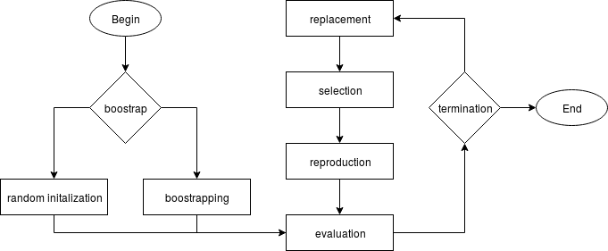

# GPEC lib
### General Purpose Evolutionary Computation library
##### `python library` | `parallel computation` | `ga/gp supported` | `island-based` | `highly customizable`

## 0 Authors
`Blazej Banaszewski`, MSc student of Robotics at University of Southern Denmark 

`John Hallam`, Professor at Mærsk Mc-Kinney Møller Institute, 
Head of Embodied Systems for Robotics and Learning at University of Southern Denmark,
and `Blazej`'s thesis supervisor.

## 1 Run
  
> $ python3 master.py <experiment_name>

## 2 Glossary
**[EA]** - Evolutionary Algorithm  
**[EC]** - Evolutionary Computation   
**[GA]** - Genetic Algorithm  
**[GP]** - Genetic Programming  
  
## 3 Filesystem
```
-- README.md
-- master.py
--
-- eval/
---- one_max/
------- code.py
------- config.xml
---- times_plus_one_max/
------- code.py
------- config.py
--
-- src/
---- Experiment.py
---- Island.py
---- utilities.py
--
-- exp/
---- logs/
---- exp1.xml
---- exp2.xml
```

**eval/**  
Fitness evaluation functions. Each function requires an input/out definition in *eval/config.xml*.     
**src/**  
Class definitions and other custom-made programs imported in *master.py*.  
**exp/**  
XML files with the available experiments.  
**exp/logs/**  
Folder contains logs from the performed experiments organized by the date.  

## 4 Experiment configuration file  

The experiment file is located in:

> exp/<experiment_name>.xml

All parameters with asterisk (*) next to their name are necessary to be specified. The parameters without asterisk
will be set to defaults if no value has been given. 

#### 4.1 Experiment customization
[*] **`chromosome_length`**  = Int  
Number of letters encoding a chromosome.

[*] **`termination_condition`** = [fitness],[time],[Int {if fitness=true}],[Int {if time=true}]   
At least one of the termination conditions has to be true. The time condition has a priority over the fitness condition.  
* `fitness` = [true/false]  
* `time` = [true/false]

#### 4.2 Island customization  

[*] **`population_size*`** = integer  
The size of a population  

**`evaluator*`** Name of fitness evaluation function  

**`parents`**  The algorithm allows multi-parent recombination. The default value is 2 parents.  

**`crossover_points`** Number of points for crossover  

**`mutation_rate`**  A chance for a gene to mutate, given in %  

**`replacement_policy`** = [elite/ss],[num_of_elites {if elite}]
Defines replacement strategy. Variants: 
* `elite`
Elitism, a certain number of the fittest individuals is injected to the next generation by default.
    * `num_of_elites` = Int
      Number of elites left in each generation. If not defined the default value is 2.
* `stead-state`
    * todo
    
**`selection_policy`** = [roulette_wheel/rank/truncation/tournament]
* `roulette_wheel` 
* `rank`
* `truncation`
* `tournament`

    
**`migration_policy`** = [out],[in],[periodical/every_generation], [period{if=periodical}]
* `periodical`  
Todo
    * `period`  
    Todo
* `every_generation`  
Todo
* `migration_out` = [true/false] 
* `migration_in` = [true/false]

**`dna_repair`**
If chosen, individuals with broken dna (e.g. invalid format for the given problem) will not be discarded. 
In order to preserve potentially valuable information of the code, such individuals will populate an repair island
and stay there until their dna has been fixed. Repaired individuals will then migrate to other islands.
When this property has been enabled for at least one island in the experiment, a repair island is created, 
assuming that the chosen evaluator allows repairing. 
To determine whether the repair for a given problem is available look at the **`dna_repair`** parameter in the evaluator's config.xml file.

## 5 Evaluation functions
#### 5.1 Available evaluators
**Genetic Algorithms:**
1. **One max** - The score is proportional to the number of ones in a binary string of a fixed length. 
2. what else?

**Genetic programming:**
1. **Times plus one max** - The score is a result of multiplying (times) and adding (plus) ones. 
2. **Beam structure in COMSOL** - The strength of a beam of given length and volume is evaluated in COMSOL Multiphysics
simulation tool.  **TODO**

#### 5.2 Adding a new definition of evaluator
The **eval/config.xml** file contains definitions of all the evaluation functions. 

```xml
<evaluation_functions>

    <function name="one_max">
        <parameters
                ea_type="ga"
                dna_letters="0,1"
                dna_length="fixed"
                dna_repair="false"
        />
    </function>

    <function name="times_plus_one_max">
        <parameters
                ea_type="gp"
                dna_letters="1,*,+"
                dna_length="fixed"
                dna_repair="true"
        />
    </function>

</evaluation_functions>
```

## 6 Implementation
Many methods have been implemented to control diversity and extend the coverage of the search space in evolutionary computation.  


### 6.1 The island model
Is an example of a distributed population model. 
- Coarse grain 
- Micro grain
- Fine grain

### 6.2 Replacement policies
##### 6.2.1 Elitism
todo

##### 6.2.2 Stead-state
todo

##### 6.2.3 Migration policies
- Pettey (1987) designed a distributed model based on the polytypic concept of a species being represented
by several types that are capable of mating and producing viable offspring. Every generation, migration sent
the best individuals in each population to each neighbour, replacing the worst individuals. 
- Tanese (1987,1989) presented a parallel genetic algorithm implemented on a hypercube structure. 
Migration occurred periodically, where migrants where selected according to fitness and replaced individuals 
selected based on fitness in the receiving population.
- Belding (1995) extended the work of Tanese (1989) where migrants were selected by choosing the first $n$ individuals 
in the local population according to a predefined ordering, effectively simulating a more random migrant selection strategy. 

- Probabilistic migration

### 6.3 Reproduction policies 
##### 6.3.1 Mutation

##### 6.3.2 Crossover
One-point crossover and multi-point crossover

### 6.4 Selection policies
Todo

##### 6.4.1 Roulette Wheel
Evolutionary robotics p. 29

##### 6.4.2 Rank based
Individuals are ranked from the best to the worst. The probability of making offspring is proportional to their rank, 
not to their fitness value. [Evolutionary robotics p. 30]

##### 6.4.3 Truncation selection
Ranking the individuals, selecting the top M of them and let them make O copies of their chromosomes, such that M x O = N.

##### 6.4.4 Tournament based
Good for parallel computation. Probably won't be implemented tho.

##### 6.4.5 Similarity-based
Todo 

## 7 Techniques of EC
- Almost all components of genetic algorithms are stochastic
- implicit parallelism, schemata 
    - schemata is major genetic operator because it generates innovation
    - mutation is a local search operator 

**Self-organization**  
adaptation process usually involves a large number of evaluations of the interactions between the system and the environment.
Using self-organization does not require any human supervision. The main advantage of relying on self-organization is
the fact that designer does not need to find the optimal solution. His efforts are redirected towards an implementation
of the environment, in this case, the evaluator. 
Emergence of complex abilities from a process of autonomous interaction between the agent and the environment. 

**types of evolutionary algorithms**  
Defined by chosen replacement strategy, like steady state, elitism etc

**crossover**  
what it is, types

**mutation**  
what it is, mutation rate

## 8 References
Evolutionary robotics, Dario Floreano