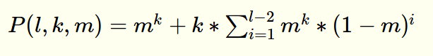

# General Purpose Evolutionary Computation
GPEC has been written in order to tame the power of evolutionary computation, 
namely making it easily applicable to variety of real-life up-to-date engineering problems. 
GPEC is a Python lightweight piece of software, which gives an user an open hand in creating programs and optimizing parameters in evolutionary manner, 
embracing many state-of-art techniques, and parallel processing oriented.

Concurrently to the development of the software, an in-depth documentation is made,
 for the purpose of spreading the knowledge and understanding of Evolutionary Computation. 
 GPEC is released under an open-source license to promote free-science.

To start evolving your own programs, plug in an evaluator of your choice, 
by following the instructions given in the documentation, 
then modify one of the existing experiment configurations or write your own,
and let the randomness of EC surprise you with its novel human-competitive solutions.

## 0 Licensing
Copyright 2018-2019 Blazej Banaszewski  
The 3-Clause BSD License

## 1 Author
`Blazej Banaszewski`, MSc student of Robotics at University of Southern Denmark.

## 2 Acknowledgements
Special acknowledgements to `John Hallam` for the support, broadening the perspectives and being an inspiration for young scientists.

## 3 Run
> $ python3 master.py experiment_name


## 4 Experiment configuration file  

The experiment files should be placed in:

> exp/experiment_name.xml

Each experiment has to consist of at least one island and one termination condition.
For each island a set of reproduction, replacement, selection and migration policies has to be defined.

Snippet **S1** shows how to prepare an experiment terminated after 6 seconds, involving two identical islands,
working together on the same problem and periodically exchanging individuals. 

```xml
<experiment chromosome_length="11" max_fitness="0" max_time="6" max_generations="0">
    <island population_size="10" evaluator="times_plus_one_max">
        <reproduction crossover_points="6" mutation_rate="10"/>
        <selection policy="roulette_wheel" num_of_parents="3" mutli-parent="true"/>
        <migration entry_policy="periodical" in="true" out="true" period="5"
                   selection_policy="truncation" immigrants="1" emigrants="1"/>
        <replacement policy="elitism" num_of_elites="2"/>
    </island>

    <island population_size="10" evaluator="times_plus_one_max">
        ...
    </island>
</experiment>
```
**S1** *An .xml configuration file for an experiment of Times Plus One Max evaluator.*

The available options for the parameters used in the configuration example have been listed below.
All parameters with an exclamation mark before the name are required and if not provided,
GPEC will return an error or output an unreliable result. 
The remaining parameters will be set to corresponding defaults if a configuration value has not been provided.


#### 4.1 Experiment customization
**`! Int chromosome_length`**  
Number of genes encoding a chromosome. 
A gene can represent for a numerical value, including its sign, or a mathematical function.

###### 4.1.0 Termination conditions
Termination conditions are inclusive, which means that termination will occur when the first of them is met.
All of the conditions need a value assigned to them. Assigning a zero disables a condition.
  
**`! Int max_fitness`**  

**`! Int max_time`**   
 
**`! Int max_generations`**   

#### 4.2 Island customization  

**`! Int population_size`**   

**`! Int evaluator`**  
Name of the fitness evaluation function. 
Islands within an experiment do not have to be evaluated by the same function.
An evaluator has to be properly defined. An instruction has been provided in **Sec. 5.2 Plugging in new evaluator**.

###### 4.2.1 Replacement policy
**`Choice replacement_policy = elitism`** 
* **`elitism`**  
A certain number of the fittest individuals are injected to the next generation. This strategy keeps the 
`num_of_elites` best results through the generations making sure that the best discovered combinations of genes survive 
the stochastic processes of selection and reproduction.
    * **`Int num_of_elites = 2`**  
    Number of elites injected to next generation.

###### 4.2.2 Migration policy
Although the migration is a sub-part of the replacement, 
for the sake of keeping GPEC as modular as possible it has been defined as a separate policy.

**`! Bool migration_out = false`**  
When `false`, an island is not sending out any emigrants.

**`! Bool  migration_in = false`**  
When `false`, an island is not taking in any immigrants.

**`Choice entry_policy = probabilistic`**
* **`periodical`**  
    * **`Int period = 5`**  
    In periodical migration an island takes in immigrants with a constant rate equal to `period` generations. 

* **`probabilistic`**  
    * **`Float chance = 10`**  
    Immigrants will be accepted `chance`% of the time a new population is evolved.   

**`Choice selection_policy = truncation`**  
The strategy for selecting an immigrant from a list of candidates. 
The list consists of all emigrants sent out on the other islands.
Once a candidate has been taken in it is no longer available. 
For the available strategies look into Section **4.2.3 Selection policy**.  

**`Int emigrants = 1`**  
Defines how many migrants will be made available for other islands. 
  
**`Int immigrants = 1`**  
Defines how many migrants will be taken in each period/call.

###### 4.2.3 Selection policy
**`Int parents = 2`**  
Number of parents used for making offspring each generation. 

**`Bool multi_parent = true`**  
When mutli-parent recombination is allowed all selected parents can contribute their genetic material to an offspring. 
Conversely, a pair of parents is selected to make each single offspring.

**`Choice selection_policy = roulette_wheel`**
* **`roulette_wheel`**  
The chance of an individual being selected is proportional to its fitness.

* **`rank`**  
The individuals are sorted based on their fitness from best to worst and the probability of making offspring is
proportional to their rank.

* **`truncation`**  
The individuals are sorted based on their fitness from best to worst and M best become parents.
Number M depends on the value assigned to `parents`.

* **`tournament`**  
Each parent is selected by randomly choosing two individuals from a generation and comparing their scores.
The fitter one becomes a parent.

###### 4.2.4 Reproduction policy

**`Int crossover_points = 2`**  
Number of points for crossover. Points divide a chromosome on equally large parts (if possible), 
e.g. a chromosome consisting of 10 genes with 2 `crossover_points` will be cross over at 5th gene (split in two). 

**`Int mutation_rate = 2`**  
A chance for a gene to mutate, given in %. This chance applies for a single gene, and the gene has to change into
other element from the primitive set. 
Something to keep in mind - the longer the chromosome, the higher the chance for the mutation to occur in a chromosome.

A chance for `k` genes to mutate in a chromosome of length `l` for the mutation rate `m` can be calculated from **E1**.

.  

   
 
.  

**E1** *Probability of `k` mutations in a `l`-long chromosome for a mutation rate `m`.*

The chances for `k={1, 2}` genes mutating in a chromosome consisting of 11 genes,
for different values of mutation rate has been shown on **T1**. For the given case and mutation rate of 7%,
every second chromosome (every 51.60% to be more specific) will be mutated at least in one gene. 

P(11, 1, m) | P(11, 2, m)   | m  
---         | ---           | --- 
9.56 %      | 0.18 %        | 1%
18.29 %     | 0.69 %        | 2% 
26.26 %     | 1.49 %        | 3%
33.52 %     | 2.52 %        | 4%
40.13 %     | 3.76 %        | 5%
46.14 %     | 5.18 %        | 6%
51.60 %     | 6.73 %        | 7%
56.56 %     | 8.41 %        | 8%

**T1** *The table showing probability of mutation occurring at least once and at least twice in a chromosome of 11 genes.*


## 5 Evaluation functions
#### 5.1 Available evaluators
###### 5.1.1 Genetic Algorithms
- **One max [1 Max]** - The score is proportional to the number of ones in a binary string of fixed length.
The primitive set is (0,1).

###### 5.1.2 Genetic programming
- **Times plus one max [TP1 Max]** - The score is a result of multiplying (times) and adding (plus) ones. For this problem the
set of primitives consists of:  

terminals| functions  
--- | --- 
1 | multiplication, *, arity 2
. | addition, +, arity 2 

**T2**  *The primitive set for the TP1 Max evaluator.*

#### 5.2 Plugging in new evaluator
The **./eval/evaluators.xml** file contains definitions of evaluation functions, which has been shown on **S2**. 

```xml
<evaluator_functions>
    <evaluator name="one_max">
        <param ea_type="ga"/>
        <param terminal_set="0,1"/>
    </evaluator>

    <evaluator name="times_plus_one_max">
        <param ea_type="gp"/>
        <param terminal_set="0,1"/>
        <param function_set="*_2,+_2"/>
        <param restriction="size"/>
    </evaluator>

    <evaluator name="symbolic_regression">
        <param ea_type="gp"/>
        <param terminal_set="x,real"/>
        <param function_set="*_2,+_2,%_2,^_2"/>
        <param restriction="depth"/>
        <param max_depth="5"/>
        <param method="ramped"/> 
    </evaluator>
</evaluator_functions>

```
**S2** *Definitions of different evaluators.*


**`! String name`**  
The evaluator name has to match the directory name in **./eval/**.

**`! List terminal_set`**             
Defines the terminal primitives for the problem. Ephemeral random constants from different sets are available under
the `real`, `bool` or `natural` parameters.

**`! Choice ea_type`**              
Type of evolutionary algorithm used for the problem. The data structure is customized here.
* **`ga`**  
Genetic algorithm represented as a fixed-length (see `chromosome_length` in **Sec. 4.1 Experiment customization**) 
string of values from `terminal_set`.

* **`gp`**  
Genetic programming represented as a string of primitives from `terminal_set` and `function_set`.
    * **`! List function_set`**  
    Defines the function primitives for the problem. Each operation has to be defined and protected in the evaluator code.
    The list consists of the parameters and their corresponding arities.
    
    * **`! Choice restriction`**  
    Methods for tree creation. 
        * **`size`**   
        The size, number of genes in the chromosome, is limited. When this restriction has been chosen, 
        `chromosome_length` parameter (see **Sec. 4.1 Experiment customization**) defines the size of all generated trees.
        
        * **`depth`**  
        The structure of the tree is limited by its depth. 
            * **`! Int max_depth`**
            * **`! Choice method`**  
                * **`full`**  
                Generates full trees, which means that all leaves are at the same depth.
                * **`grow`**  
                This method allows for the creation of trees of more varied sizes and shapes. 
                Nodes are selected from the primitive set until the `max_depth` is reached.
                Then only terminal nodes can be chosen.
                * **`ramped`**  
                Half of the initial population is created using `full` method and the other half using `grow` method. 
                This is achieved by using a range of depth limits smaller or equal to `max_depth`. 
                This method ensures trees having a variety of sizes and shapes.
        * **`none`**  
        Unconstrained size and depth of the evolved programmes.


## 6 Implementation of parallelism
The following section aims in providing an insight into the architecture of GPEC.

Evolutionary Computation can benefit from the emergent properties of parallel searching. 
W. Punch in his paper [3], points out to a property called *superlinear speedup*. 
It emerges in many applications of GA, 
resulting in total amount of work (in this case evaluations) needed for finding a good solution
decreasing for each extra parallel evolutionary subprocess at the disposal of the searching device. 

In order to create a tool which utilizes superlinear speedup and enables using GA for complex and time-consuming problems,
an architecture that supports parallel computation has been designed. The overview of the implemented architecture can be seen on **F1**.   

.  
.  
. 
.  
 
  
.   
.  
.  
.  

**F1** *The flowchart of parallel evaluation handled in the experiment class.*

One of the popular models supporting parallel computation is called **the island model**, 
based on the idea of divergence within a species occurring when populations has been separated e.g. due to a natural catastrophe.  

#### 6.1 The island model
On the **F2** the implementation of the island class has been presented. 
In the Punch's article three approaches for utilizing parallelism in GA have been brought up.

.  
.  
.  
.  
 
  

.  
.  
.  
.  

**F2** *The flowchart of replacement, migration, selection and reproduction of a population has been implemented in GPEC.*

###### 6.1.1 Micro-grain
Is the simplest form of parallelism in GA, where only the evaluation functions are asynchronous,
and stepping into next generation occurs when all individuals have been tested, hence evolution is not parallel. 
This approach can be used in GPEC experiments by defining only one island.

###### 6.1.2 Fine-grain 
Here spatial distribution of individuals is used to take a full advantage of the parallelism.
The support of this approach in GPEC has not been provided yet. For more information see **Sec. 7.3 Fine grain**.

###### 6.1.3 Coarse-grain
The parallelism occurs both in evaluation and evolution. This approach is not fully asynchronous in evolution, since
before individuals can step into the next generation, all individuals from their island have to be evaluated. 
In GPEC this approach can be used in experiments by defining more than one island in an experiment configuration file.


## 7 In development
This section covers all the techniques that has not been implemented yet, but are planned to be before moving to the
next stage of the project which is the master thesis experiments.  

#### 7.1 Genetic Programming
###### 7.1.1 Depth restricted and unrestricted tree growth
These methods will allow to use evaluators of additional data type structures, namely trees with shape restrictions
in depth and completely unrestricted trees (free to grow in size and depth). 

###### 7.1.2 Pruning
This method will be used for reducing the depth of the trees that exceeded the `max_depth`
in depth-restricted genetic programming experiments, e.g. in a result of the subtree crossover. 

###### 7.1.3 Headless chicken mutation
It is a subtree mutation method implemented as crossover between an individual, a program, and a newly generated random program. 
Only one modification of such kind is allowed per tree. 
`Headless chicken` will be working inclusively with `point-mutation` which has been already implemented.  

#### 7.2 Similarity-based selection
Similarity-based selection is a part of multi-objective evaluation, yet instead of performed in evaluators as scores for other objectives,
will be computed by GPEC main body. 
A matrix of `n x n` dimension, where `n = total number of individuals` will contain information about similarity between all
individuals. In order to reduce the convergence of the population to the genotype of the leading individuals, 
similarity between islands will be taken into consideration in the migration process. In order words, the diversity of the
population will be promoted when choosing which individual to take in from other islands in a replacement phase. 

#### 7.3 Fine-grain
Fine grain stands as the most parallel friendly implementation of the island model, where each individual in a
population evolves asynchronously. This approach will be compared with the Coarse- and Micro-grain methodologies
to quantify the amount of reduction in amount of evaluations different kinds of parallelism can introduce to a search.

#### 7.4 Evaluators
###### 7.4.1 Symbolic regression
Evaluates how well a provided expression models a polynomial function. 
The polynomial against which the expression is tested can be arbitrarily changed inside of the evaluator.

terminals| functions  
--- | --- 
x | multiplication, *, arity 2
real| addition, +, arity 2
. | subtraction, -, arity 2
. | exponentiation, ^, 2
. | protected division, %, 2 

**T3** *The primitive set for the symbolic regression evaluator.*

Symbolic regression uses depth-restricted tree growth which also is in the development stage (**Sec. 7.1 Genetic Programming**).

###### 7.4.2 Surface Max
Evolved programmes will be procedurally modeling a 3D structure in OpenSCAD. 
A volume and a surface of a generated polyhedron will be measured and used to calculate a fitness. 
The volume will have an inversely proportional, and the surface a proportional effect on the score.

###### 7.4.3 Beam Strength Max
In part similarly to evaluator in **7.4.1 Surface Max**, generated programmes will be performing a procedural modeling in OpenSCAD.
Created models will have a structure of a beam. The results will be used in a COMSOL Multiphysics simulation,
where the models will be tested against different forces. 
The idea is to grow novel structures for a beam by prioritizing reduction in a volume and optimizing for a strength.
Finally, the most interesting approaches will be 3D printed and their strength evaluated in a real-life stress experiment.  
 
#### 7.5 Stead-state replacement policy
Extending the replacement policy by the option of stead-state evolution.

#### 7.6 Genotype repair 
In order to preserve potentially valuable information of the code, 
individuals with invalid genotypes (e.g. invalid format for the given problem) will not be discarded. 
The individuals with invalid genotypes will migrate to Repair Island and stay there until their code has been fixed.
Repaired individuals will then migrate to other islands. 

#### 7.7 Finding optimal parameters
In attempt to find underlying patterns in influence of genetic operators on problems of different nature,
a series of comparative tests will be performed.

Evolutionary Computation is to high extend a stochastic method, where the result of one experiment should not be used to 
evaluate a GP's performance for given settings. For this reason, and in order to find the heuristics of optimality,
a procedure will have to be implemented where the same experiment is called many times, then the gathered results averaged,
and a standard deviation calculated.
The aforementioned tests have not been performed yet due to current GPEC's insufficient maturity to do it in a harmony with scientific method.


## 8 Results
The tests described in this section serve rather as a confirmation of GPEC usability for finding good solutions, 
than comparative study of heuristics for finding optimal genetic operators,
which was initially assumed to be the foundation for this project.
A more detailed explanation can be find in **Sec. 7.7 Finding optimal parameters**.

The **T4** shows how the performed experiments have been configured. 

-|islands|genes|max fitness|population|reproduction|selection|migration|replacement
--- | --- | --- | --- | --- | --- | --- | --- | ---
One Max | 1 | 50 | 50 | 10 | 5 crossover points, 1% mutation rate | roulette wheel, 2 parents | probabilistic with 1% chance, truncation | elitism with 2 elites
.       | 2 | 50 | 50 | 20 | 5 crossover points, 25% mutation rate | rank based, 2 parents | probabilistic with 1% chance, truncation | elitism with 2 elites
.|.|.|.|.|.|.|.|.
TP1 Max | 1 | 21 | 48 | 10 | 5 crossover points, 5% mutation rate | tournament, 2 parents | probabilistic with 1% chance, truncation | elitism with 1 elite
.       | 2 | 21 | 48 | 25 | 5 crossover points, 5% mutation rate | rank based, 3 parents | probabilistic with 3% chance, truncation | elitism with 1 elite
.       | 3 | 21 | 48 | 50 | 5 crossover points, 15% mutation rate | roulette wheel, 4 parents | probabilistic with 5% chance, truncation | elitism with 1 elite

**T4** *The configuration values chosen for the two experiments performed in order to prove GPEC usability.*

.  
.  
.  
.  
.  
.  
.  
.  
.  
.  
.   

evaluator   |generations|time   |total migrations   |evaluations
---         |---        |---    |---                |---
One Max     |47         |61.9 s |4                  |3950
TP1 Max     |121        |44.9 s |3                  |3195    

**T5** *Table showing the performance of two experiments run on 1 Max and TP1 Max evaluators.*


## 9 References
[1] *Evolutionary Robotics*,  by D. Floreano  
[2] [*A Field Guide to Genetic Programming*](https://dces.essex.ac.uk/staff/rpoli/gp-field-guide/A_Field_Guide_to_Genetic_Programming.pdf),
by R. Poli, W. B. Langdon, N. F. McPhee  
[3] [*The problem-dependent nature of parallel processing in genetic programming*](http://citeseerx.ist.psu.edu/viewdoc/download?doi=10.1.1.408.8428&rep=rep1&type=pdf),
 W. F. Punch
