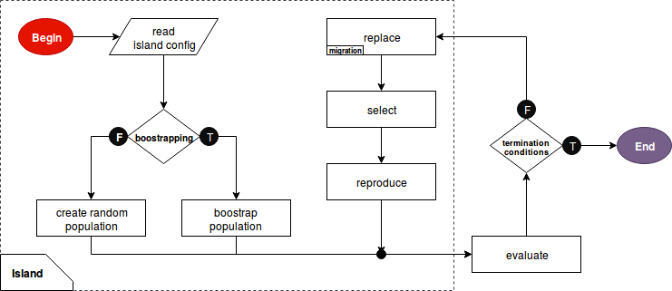

# GPEC lib
### General Purpose Evolutionary Computation library
##### `python library` | `parallel computation` | `ga/gp supported` | `island-based` | `highly customizable`

## 0 Authors
`Blazej Banaszewski`, MSc student of Robotics at University of Southern Denmark 

`John Hallam`, Professor at Mærsk Mc-Kinney Møller Institute, 
Head of Embodied Systems for Robotics and Learning at University of Southern Denmark, also `Blazej`'s thesis supervisor.

## 1 Run
> $ python3 master.py <experiment_name>

## 2 Glossary
**[EA]** - Evolutionary Algorithm  
**[EC]** - Evolutionary Computation   
**[GA]** - Genetic Algorithm  
**[GP]** - Genetic Programming  
  
## 3 Filesystem
```
README.md
master.py
eval/
--- one_max/
-------- code.py
-------- config.xml
--- times_plus_one_max/
-------- code.py
-------- config.py
src/
--- Experiment.py
--- Island.py
--- utilities.py
exp/
--- one_max_1is.xml
--- one_max_2is.xml
--- times_plus_one_max_2is.xml
--- logs/
-------- one_max_1is_<date>_<time>.log
-------- one_max_2is_<date>_<time>.log
-------- times_plus_one_max_1is_<date>_<time>.log
scripts/
--- progress_plotter.py
```


## 4 Experiment configuration file  

The experiment file is located in:

> exp/<experiment_name>.xml

All parameters with asterisk (*) next to their name are necessary to be specified. The parameters without asterisk
will be set to defaults if no value has been assigned. The default values are written in square parenthesis in italic,
after the type.

An exemplary experiment configuration structure has been shown below.

```xml
<experiment chromosome_length="16" max_fitness="16" max_time="0">
    <island population_size="5" evaluator="one_max" genotype_repair="false">
            <reproduction crossover_points="5" mutation_rate="5" num_of_parents="2"/>
            <replacement policy="elite" num_of_elites="2"/>
            <selection policy="roulette_wheel"/>
            <migration policy="periodical" in="true" out="true" period="5"/>
    </island>
</experiment>
```

#### 4.1 Experiment customization
[*] Int **`chromosome_length`**   
Number of letters encoding a chromosome.

[*] Int **`max_fitness`**    
At least one of the termination conditions has to be true.  

[*] Int **`max_time`**   
 The time condition has a priority over the fitness condition.

#### 4.2 Island customization  

[*] Int **`population_size`**   
The size of a population  

[*] Int **`evaluator`**  
Name of fitness evaluation function. The evaluator has be defined in **eval/** folder.  

Bool **`genotype_repair`** = False    
If chosen, individuals with broken dna (e.g. invalid format for the given problem) will not be discarded. 
In order to preserve potentially valuable information of the code, such individuals will populate an repair island
and stay there until their dna has been fixed. Repaired individuals will then migrate to other islands.
When this property has been enabled for at least one island in the experiment, a repair island is created, 
assuming that the chosen evaluator allows repairing. 
To determine whether the repair for a given problem is available 
look at the **`genotype_repair`** parameter in the evaluator's config.xml file.

###### 4.2.1 Replacement policy
Choice **`replacement_policy`** = elitism   
Defines replacement strategy. Variants: 
* `elitism`  
Elitism, also known as \theta<tab>, a certain number of the fittest individuals is injected to the next generation by default.
    * Int `num_of_elites` = 2  
      Number of elites left in each generation. If not defined the default value is 2.
* `stead-state`
    * todo

###### 4.2.2 Migration policy
[*] Bool **`migration_out`** = False  

[*] Bool **`migration_in`** = False

Choice **`entry_policy`** = probabilistic
* `periodical`  
    * Int `period` = 5  
    Defines the number of generations between accepting a immigrant to an island. 
* `probabilistic`  
    * Float `chance` = 10  
    A probability to take an immigrant in each generation.   

Choice **`selection_policy`** = roulette_wheel   
The strategy for selecting an immigrant from a list of candidates. 
The candidates are considered to be all available migrants from the different islands than the one opening its boarders.
Same options as in Section **4.2.3 Selection policy**.  

Int **`emigrants`** = 1  
Defines how many migrants will be available for other islands. 
  
Int **`immigrants`** = 1  
Defines how many migrants will be taken in each period/call.

###### 4.2.3 Selection policy
Choice **`selection_policy`** = roulette_wheel
* `roulette_wheel` 
* `rank`
* `truncation`
* `tournament`

###### 4.2.4 Reproduction policy
Int **`parents`** = 2  
The algorithm allows multi-parent recombination. The default value is 2 parents.  

Int **`crossover_points`** = 2  
Number of points for crossover  

Int **`mutation_rate`** = 10  
A chance for a gene to mutate, given in %  


## 5 Evaluation functions
#### 5.1 Available evaluators
###### 5.1.1 Genetic Algorithms
- **One max** - The score is proportional to the number of ones in a binary string of a fixed length. 

- what else?

###### 5.1.2 Genetic programming
- **Times plus one max** - The score is a result of multiplying (times) and adding (plus) ones. 

- **Max surface const volume** - Generating a model made out of adjacent cubes. The volume of the final model is constant
what is being optimized is the size of the cubes and their position in order to maximize the surface of the model.
**to be implemented**

- **Beam structure in COMSOL** - The strength of a beam of given length and volume is evaluated in COMSOL Multiphysics
simulation tool.  
**to be implemented**

#### 5.2 Adding a new definition of evaluator
The **eval/config.xml** file contains definitions of all the evaluation functions. 

```xml
<evaluator name="one_max">
    <param ea_type="ga"/>
    <param letters="0,1"/>
    <param chromosome_length="fixed"/>
    <param genotype_repair="false"/>
</evaluator>
```


## 6 Implementation
#### 6.1 Parallel processing


###### 6.1.1 The island model
  
Is an example of a distributed population model. 
- **Coarse grain**
 
- **Micro grain**

- **Fine grain**

#### 6.2 Replacement
Replacement policies

###### 6.2.1 Elitism
todo

###### 6.2.2 Stead-state
todo

###### 6.2.3 Migration
- Belding (1995) extended the work of Tanese (1989) where migrants were selected by choosing the first $n$ individuals 
in the local population according to a predefined ordering, effectively simulating a more random migrant selection strategy. 

- Entry policies: Probabilistic or Periodical
    - Pettey (1987) designed a distributed model based on the polytypic concept of a species being represented
by several types that are capable of mating and producing viable offspring. Every generation, migration sent
the best individuals in each population to each neighbour, replacing the worst individuals. That would be a periodical entry
migration with `period` set to 1.
    - Tanese (1987,1989) presented a parallel genetic algorithm implemented on a hypercube structure. 
Migration occurred periodically, where migrants where selected according to fitness and replaced individuals 
selected based on fitness in the receiving population. That would be a periodical migration with rank based selection.

- Selection policies: Look at Section **6.4 Selection**. The same strategies are available for immigrant selection.
- Migration success rate - depends on whether the island could find a migrant when it wanted. If you migration rate
is less than 80%, consider increasing `emmigrants` or reducing `immigrants` in island customization file. 

#### 6.3 Reproduction
Different reproduction methods implemented. TODO
 
###### 6.3.1 Mutation
Mutation rate. TODO

###### 6.3.2 Crossover
One-point crossover and multi-point crossover. TODO

###### 6.3.3 Recombination
Multi-parental and single parents recombination.

#### 6.4 Selection
Different selection policies implemented.

###### 6.4.1 Roulette Wheel
Evolutionary robotics p. 29

###### 6.4.2 Rank based
Individuals are ranked from the best to the worst. The probability of making offspring is proportional to their rank, 
not to their fitness value. [Evolutionary robotics p. 30]

###### 6.4.3 Truncation
Ranking the individuals, selecting the top M of them and let them make O copies of their chromosomes, such that M x O = N.

###### 6.4.4 Tournament
Good for parallel computation. Probably won't be implemented tho.

###### 6.4.5 Similarity-based
Todo 

#### 6.5 Evaluation
- In case of GP, a decoding might be needed. Reverse Polish Notation.
- Fitness evaluation. 
- Phenotype validity check
    - if chromosome is not properly encoded an individual can be send to a repair island. 
        - Information preservation.


## 7 Results
#### 7.1 One Max
todo

#### 7.2 Times Plus One Max
Todo: deriving a math formula for finding maximum fitness for a tree of any size.


## 8 Techniques
#### 8.1 Evolutionary computation
###### 8.1.1 Self-organization  
adaptation process usually involves a large number of evaluations of the interactions between the system and the environment.
Using self-organization does not require any human supervision. The main advantage of relying on self-organization is
the fact that designer does not need to find the optimal solution. His efforts are redirected towards an implementation
of the environment, in this case, the evaluator. 
Emergence of complex abilities from a process of autonomous interaction between the agent and the environment. 

###### 8.1.2 Schemata
- Evolutionary Robotics book
- Almost all components of genetic algorithms are stochastic
- implicit parallelism, schemata 
    - schemata is major genetic operator because it generates innovation
    - mutation is a local search operator 

###### 8.1.3 Speedup
- Linear speedup
- Super-linear speedup

###### 8.1.4 Pre-mature convergence


#### 8.2 Solid modeling
###### 8.2.1 Procedural modeling

###### 8.2.2 Constructive solid geometry

###### 8.2.3 OpenSCAD 
 

#### 8.3 Simulation
###### 8.3.1 COMSOL Multiphysics


## 9 References
Evolutionary Robotics, Dario Floreano